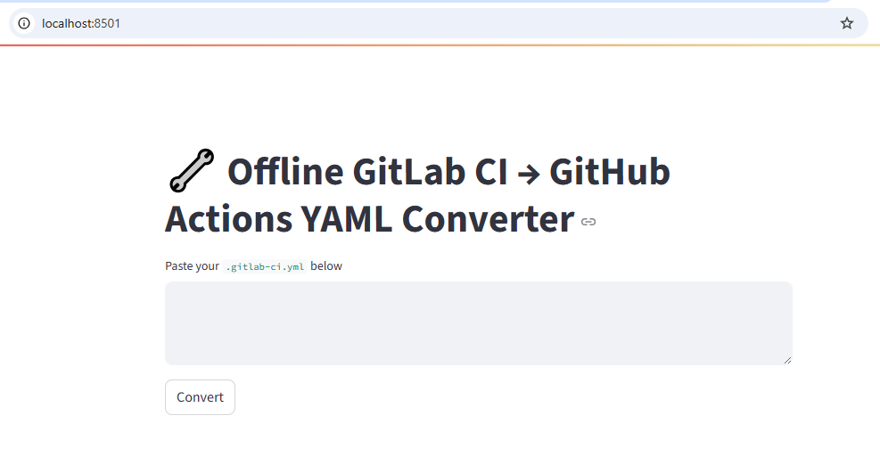
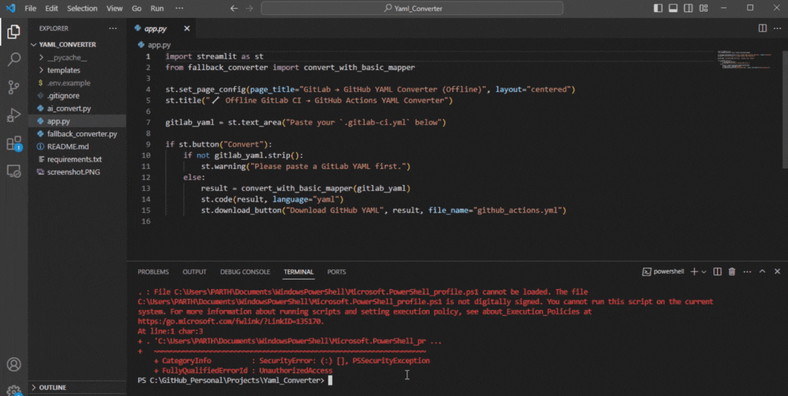

# 🔁 GitLab CI ➜ GitHub Actions YAML Converter (AI + Offline)

A smart Python-based tool that converts `.gitlab-ci.yml` files into valid `.github/workflows/*.yml` files — powered by AI (OpenAI) or offline fallback (ci2gha). Ideal for DevOps engineers migrating pipelines or experimenting with automation.

---

## 🚀 Features

- 🧠 **AI-Powered Conversion** (Streamlit + OpenAI)
- 🛠️ **Offline Fallback** with `ci2gha` if no API key
- 🧾 **Paste & Convert Interface** – no setup required
- 🪄 Supports basic job translation, runners, scripts
- 💡 Designed for DevOps engineers, students, and teams

---

## 🖼️ UI Preview



---

## ⚙️ Tech Stack

- Python 🐍
- Streamlit 🎨 (for GUI)
- OpenAI API 🤖 (for GPT conversion)
- `ci2gha` 🔄 (offline GitLab-to-GitHub converter)
- YAML 🧾

---

## 💻 How to Run Locally

### 1. Clone the repo
```bash
git clone https://github.com/PnpGitHub/Yaml_Converter.git
cd Yaml_Converter
```

### 2. Create and setup `.env` file
```bash
cp .env.example .env
# Add your OpenAI API key inside .env
```

### 3. Install dependencies
```bash
pip install -r requirements.txt
```

### 4. Run the app
```bash
streamlit run app.py
```

---

## 🌐 .env Example

```env
OPENAI_API_KEY=sk-xxxxxxxxxxxxxxxxxxxxxxxxxxxx
```

(🔐 Keep your real key safe. Never commit your `.env` file!)

---

## 🛡️ Safety & Best Practices

- ✅ `.env` is `.gitignore`d
- 🔁 Git history scrubbed to remove secrets
- 📁 Clean repo with `.env.example` for guidance
- ⚠️ Never expose your API key — even by mistake

---

## 🧠 Why I Built This

While migrating CI/CD pipelines from GitLab to GitHub at scale, I built internal YAML config tools. This is a smarter version — now with AI support. A time-saver and productivity booster!

---

## 📦 Future Improvements

- 🌍 Add support for Bitbucket and Azure pipelines
- 🧪 Test case builder (auto steps generation)
- 💬 Natural language prompt → CI YAML (AI magic)
- 🛑 Lint & validation integration for output workflows

---

## 📸 Demo



---

## 🤝 Connect with Me

**Parth Prajapati**  
DevOps Engineer | CI/CD Specialist | AWS Certified  
🔗 [LinkedIn](https://www.linkedin.com/in/parthprajapati39/)  
💼 [Portfolio](https://github.com/PnpGitHub)

---

## 📝 License

MIT License – free to use, modify, and contribute!
